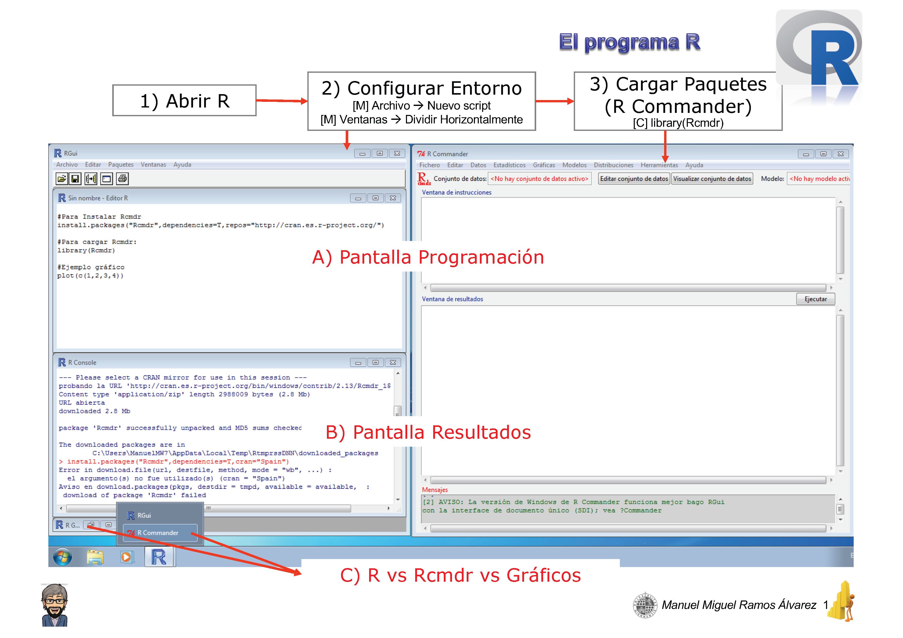
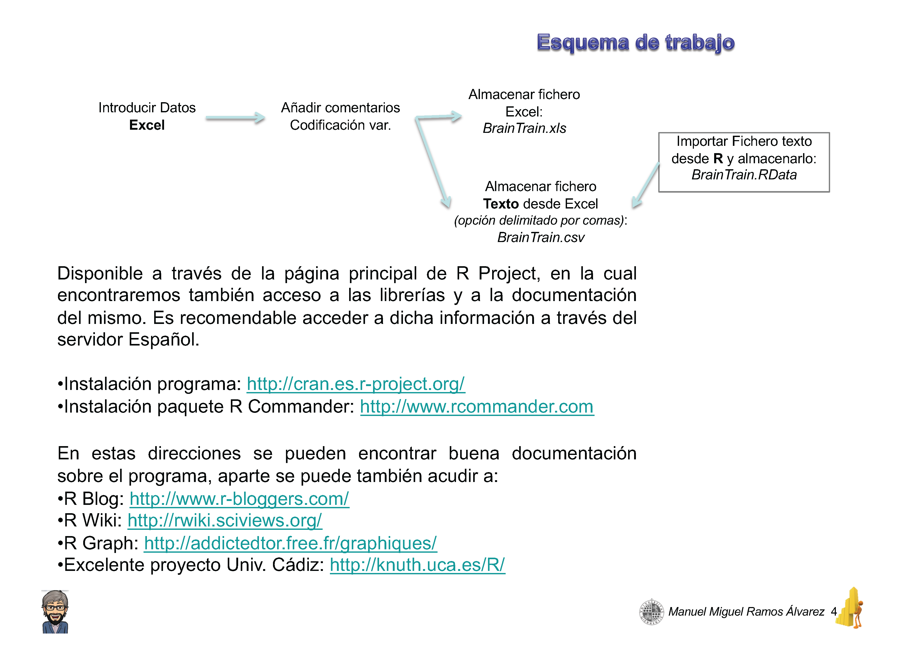
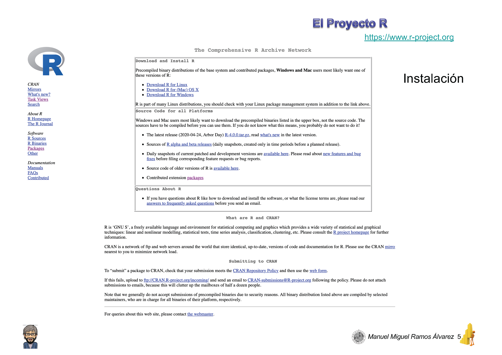
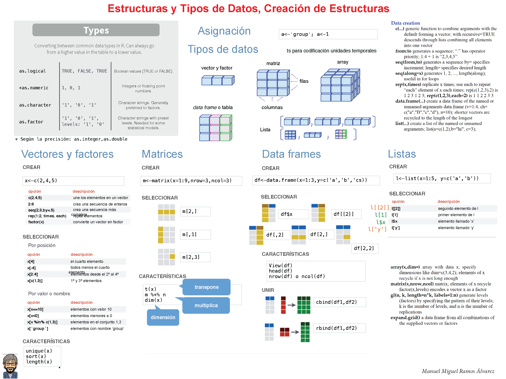
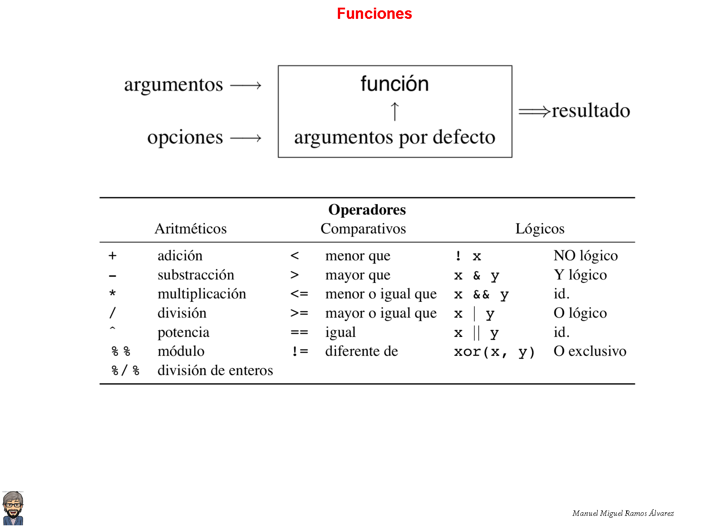
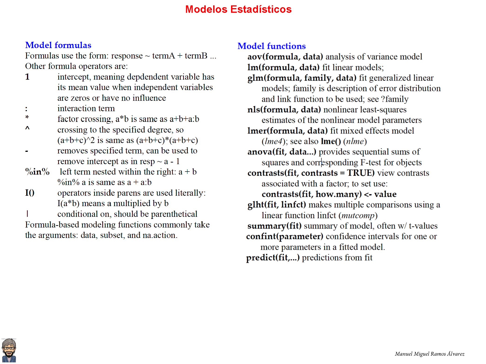

```{r setup, include=FALSE}
 library(knitr)
 knitr::knit_hooks$set(optipng = knitr::hook_optipng)
 knitr::opts_chunk$set(echo = TRUE,comment = "",error=FALSE, warning = FALSE, message = FALSE, fig.show='hold',results='hold', collapse = TRUE, optipng='-o7')
```

```{css, echo=FALSE}
.watch-out {
  background-color: #FFECEE;
  border: 1px solid gray;
}
```

```{css, echo=FALSE}
.main-container {
    max-height: 800px !important;
    overflow-y: scroll !important;
    overflow-x: auto !important;
}

pre {
  max-height: 800px !important;
  overflow-y: scroll !important;
  overflow-x: auto !important;
}
pre code {
  max-height: 800px !important;
  overflow-y: scroll !important;
  overflow-x: auto !important;
}
```

Recursos:

-   [Hansjörg N. (2020). Data Science for Psychologists. Retrieved from: https://bookdown.org/hneth/ds4psy/](https://bookdown.org/hneth/ds4psy/)\

-   [Neth, H. (2020). ds4psy: Data science for psychologists. Retrieved from: https://CRAN.R-project.org/package=ds4psy](https://CRAN.R-project.org/package=ds4psy)\

-   [Wickham, H., & Grolemund, G. (2017). R for data science: Import, tidy, transform, visualize, and model data. Retrieved from: http://r4ds.had.co.nz](http://r4ds.had.co.nz); [Versión pdf](https://drive.google.com/uc?export=download&id=16cQFB4URr3AUZ_8IzidMegYHwBarMtT2)

-   [Everitt, B.S. y Hothorn, T. (2010, 2Th Ed). A Handbook of Statistical Analysis using R. Taylor and Francis Group](https://drive.google.com/uc?export=download&id=1mHhHoy-kK98qGd4B0FetkzsalqolVjuT)

-   [Judd, C.M., McClelland, G.H. y Ryan, C.S. (2017, 3ª Ed). Data Analysis: A Model Comparison Approach To Regression, ANOVA, and Beyond. San Diego, CA: Routledge](https://drive.google.com/file/d/1Kp57r5OYrgMSxpc06RDJm_hXmGqre0Ns/view?usp=sharing)\

-   [Li Y. y Baron J. (2012). Behavioral Research Data Analysis with R. Springer](https://drive.google.com/uc?export=download&id=11Vtd0p8_GPAYdKsX_ETFwTAGyFSbgwUH)\

-   [Maxwell, S.E., Delaney, H.D. y Kelley, K. (2017. 3ª Ed). Designing experiments and analyzing data: a model comparison perspective. Wadsworth Belmont, California: Routledge](https://drive.google.com/uc?export=download&id=1W8qvPq_K31K6adVEhiv_iGOb3nivPfYe)

Preliminares: librerías

```{r warning=FALSE, message=FALSE}
library("tidyverse")
library("ds4psy")
library("data.table")

  
```

------------------------------------------------------------------------

> Cita: Ramos-Álvarez, M.M. (2017).*Introducciòn a R*. Recuperado 15 septiembre 2024, desde <https://github.com/ManuMi68/StatMmRa/blob/main/IntroduceR.html>

------------------------------------------------------------------------

> Ejemplo extraído de: [Ramos-Álvarez, M.M. (2020). Bases Conceptuales del Análisis de Datos](https://drive.google.com/uc?export=download&id=1UEoM5N246eIdf5gq3oWX0eUQgzmQWB9O).\
> Imagine que realiza una investigación sobre la influencia de las técnicas de entrenamiento cognitivo basado en el programa Brain TrainingTM. En concreto usted y otros tres compañeros reciben entrenamiento de este tipo y después de tres sesiones obtienen las puntuaciones 9, 8, 7 y 8 respectivamente en una prueba de memoria.\
> Supongamos que aplicamos a otro grupo de 4 compañeros tres sesiones con un video-juego también de la misma compañía de Brain TrainingTM pero que no refuerza la memoria, y observamos que éstos obtienen 5, 5, 7 y 7 puntos respectivamente.\
> Finalmente, se replica en otro grupo de profesores el estudio con el video-juego alternativo y se encuentran las puntuaciones 8, 1, 8 y 7.\
> La ejemplificación del proceso de Análisis de Datos a partir de esta sencilla investigación experimental sería la siguiente:

 <br>

Fichero de datos para comprobaciones: [BrainTrain.csv](https://drive.google.com/uc?export=download&id=1hL1JDVyR8XomOuGsO6UxHUmWJP7dO4Yd)

Fichero con el código del tutorial en R Studio: [CienciaDatosMmRaCode.Rmd](https://drive.google.com/uc?export=download&id=16ea3cAVpgEDgILOBVrR1cxFdQnA1snus)\
\newpage

# **Introducción**

El objetivo de este módulo será aprender a establecer un esquema de trabajo óptimo (que no significa el mejor o el único) para estar en disposición de hacer Ciencia de Datos. De esta manera sentaríamos las bases para profundizar en los aspectos fundamentales a partir de los módulos posteriores. Para ello necesitamos una buena herramienta computacional de cálculo, versátil y asequible. Esto lo conseguiremos de la mano del programa R (<https://www.r-project.org>) y el entorno R Studio (<https://rstudio.com>). Una vez que tengamos instalados los dos programas y nos hayamos familiarizado con los mismos, crearemos nuestro propio marco de trabajo en R Studio mediante un fichero del tipo R Markdown. En este marco podremos aprender a establecer nuestro propio esquema de trabajo para empezar a hacer Ciencia de Datos, de la mano del supuesto de prácticas inspirado en la investigación con Brain Training.

## Preparar la herramienta: entorno de trabajo a partir del programa R

Aunque no es necesario, dado que la instalación del entorno R es sencilla, en el siguiente enlace puedes consultar un video para la instalación [en el entorno de Windows](https://drive.google.com/file/d/1z7nYRQaGMbqTgf1QT7StZKho6-O5hF_9/view?usp=sharing) o bien [en el entorno de Mac](https://drive.google.com/file/d/1dYzgAribKGigXdoGgwP3VI_zlSVJBy4v/view?usp=sharing)

 <br>

 <br>

 <br>

 <br>

 <br>

 <br>

 <br>

 <br>

## Preparar nuestro esquema de trabajo: empezar a realizar análisis estadístico propio de Ciencia de Datos con R

Todos los fragmentos de código que se incluyen en el tutorial están preparados de tal manera que pueda copiarlos en el portapapeles para pegarlos en su entorno de trabajo R-Mardown y editarlos con sus propias notas. Recuerde que puede incluir notas comenzando la línea con el símbolo de hashtag('\#'), toda vez que se definen fragmentos de código Insertando 'chunks'.

A continuación se incluye un resumen sobre el entorno R-Studio, el cual puede imprimir expresamente a partir del documento: [R Studio IDE Guía Rápida](https://drive.google.com/open?id=1n5fPTfAuzlhYaY80YSOVy3wpjD_c6H6O)

 <br>

También se incluye un resumen para aprender a manejar los aspectos fundamentales del programa R en general, el cual puede también imprimir expresamente a partir del documento: [Base R Cheat Sheet 1](https://drive.google.com/open?id=1pr8dZH-3XkwANu1QJ4gMqKgJofUVWQv6)

 <br>

 <br>

\newpage

**1) Las librerías (packages) son fundamentales**.\
R es algo así como un programa de análisis con potencial, pero a la que vamos añadiendo funcionalidad al indicarle las librerías específicas que nos servirán para llevar a cabo aquellos análisis específicos que nos interesan, o bien librerías que permiten manejar la información.\
La fuente de referencia básica para encontrar las librerías será la página oficial del programa R (<https://cloud.r-project.org/web/packages/>). En cada sesión tenemos que recordar que hay que cargar las librerías de interés.\
Además, si es la primera vez, hay que instalarlas en nuestro entorno de trabajo.\
Empezamos a escribir en el código ...

```{r warning=FALSE, message=FALSE}
# Únicamente la primera vez insalaremos las librerías
#  (quitamos momentáneamente el hashtag y después lo volvemos a incluir)
# install.packages("Rcmdr")
# Y entonces la cargamos en memoria
  library(Rcmdr)
```

La librería R-Commander es una buena opción para iniciarse en R, puesto que a través de un sistema de menús permite generar los comandos de R para las opciones más representativas de análisis. En este momento sería interesante que explorase la misma, intentando ubicar aquello que es más importante en el análisis de los datos: Opciones de análisis como descripción de los datos, Regresión Lineal, ANOVA, representaciones gráficas, etc.\
Una vez que la haya explorado, no olvide cerrar Rcmdr

Para familiarizarse con las Librerías y el Funcionamiento de R:

 <br>

\newpage

**2) Preparamos la información a partir de los datos que nos interesan.** Para ello codificamos los datos de Brain Tarining. Progresaremos desde el vector como unidad básica hacia los marcos (*data.frame*)

```{r warning=FALSE, message=FALSE}
  # Ejemplo 1 .- Brain Training
  # Desde el vector como unidad básica hacia los marcos
  Memoria <- c(9,8,7,8,5,5,7,7,8,1,8,7)
  Grupos <- c("BrainT", "BrainT", "BrainT", "BrainT", "VideoJ", "VideoJ", "VideoJ", 
              "VideoJ", "RepVideoJ", "RepVideoJ", "RepVideoJ", "RepVideoJ")
  Grupos<-as.factor(Grupos)
```

Hemos almacenado los datos de memoria en la variable denominada **Memoria** y la variable independiente en **Grupos**. En cualquier momento podemos explorar lo que contienen las variables a partir del panel derecho de R-Studio o sencillamente, de manera más interactiva, tecleando y ejecutando el nombre de dicha variable. Por ejemplo:

```{r warning=FALSE, message=FALSE}
# Para explorar el contenido de la variable de medida (o variable dependiente)
Memoria
```

```{r warning=FALSE, message=FALSE}
# Para explorar el contenido de la variable independiente
Grupos
```

R incluye funciones muy potentes para la **creación de estructuras de información**: rep, seq, paste, gl, expand.grid

```{r warning=FALSE, message=FALSE}
  # Secuencias regulares
  rep(3,4)
  NivGrupos <- c("BrainT", "VideoJ", "RepVideoJ")
  rep(NivGrupos,4)
  rep(x=NivGrupos,each=4)
  seq(2,10) #ó  c(2:10)
  seq(-2,-10,by=-1)
  paste0(c("X"), 1:10, sep="")
  gl(3, 4, label=NivGrupos) # Para generar factores con n niveles y k replicaciones
  # Secuencias aleatorias, por ej. a partir de una distribución
  #  Normal de media 0 y desviación típica la unidad
  rnorm(50,0,1)
```

Explore con detenimiento todas las opciones. Habrá podido constatar que prácticamente todas las operaciones en el programa se realizan a través de **funciones**, las cuales se aplican sobre argumentos. Por ejemplo *rep* incluye argumentos como x, times, each, algunos de los cuales tienen valores por defecto: rep(x, times = 1, length.out = NA, each = 1).

```{r}
  # analice los parámetros de algunas funciones
  help(rep)
  help(seq)
```

Ahora volvemos sobre variables del tipo categórico, con niveles, como es usual en las variables independientes; es decir con lo que R define como **factores**:

```{r warning=FALSE, message=FALSE}
  NivGrupos <- c("BrainT", "VideoJ", "RepVideoJ")
  Grupos <- gl(3, 4, label=NivGrupos)
  Grupos
```

Podemos constatar que esta forma de crear la variable Grupos es preferible a la opción previa, aunque el resultado es prácticamente el mismo.\
Y ahora podemos juntar todas las partes (vectores) de la información en una única estructura de datos: los marcos (***data.frame***), la estructura por excelencia en R.\
Para entender esta estructura tan importante, la compararemos además con otras estructuras relevantes, ligeramente diferentes en función del objetivo que tiene dicha estructura de datos: las listas, estructuras temporales o tablas.

```{r warning=FALSE, message=FALSE, size = 'tiny'}
  # La estructura definitiva de datos: Marcos (data.frame)
  BrainTrain <- data.frame(Grupos, Memoria)
  BrainTrain
  # Diferencia con las listas genéricas
  list(Grupos, Memoria)
  # Estructuras con codificación temporal
  # Asigna momentos temporales a las medidas de Memoria, 
  # por ejemplo una medida al mes que empezaron el 2º mes del año 2008.
  ts(Memoria, frequency = 12, start = c(2008, 2))
  # Tablas de frecuencias (contingencia)
  table(Memoria,exclude = NULL)
```

\newpage

Para familiarizarse con las Estructuras y Tipos de Datos, así como la creación de estructuras:

 <br>

\newpage

**3) Ahora estamos en disposición de modificar la estructura original de datos**. Para ello incluiremos algunas funciones adicionales algo más complejas para creación de estructuras e incorporaremos una nueva variable a los datos de Brain Training.

```{r warning=FALSE, message=FALSE}
  # Mas sobre estructuras de creación de información

  
  expand.grid(a=c(1:2),sexo=c("Varon", "Mujer"),Grupos=NivGrupos)
  
  NivGrupos <- c("BrainT", "VideoJ", "RepVideoJ")
  Grupos <- gl(3, 4, label=NivGrupos)
  Grupos
  NivSex <- c("Varon", "Mujer")
  Sex <- gl(2, 6, label=NivSex)
  Sex
  interaction(Grupos, Sex)
  
  # Añadimos la variable Sexo a nuestro marco de datos
  NivSex <- c("Varon", "Mujer")
  BrainTrain$Sexo<-gl(2, 2, 12,label=NivSex)
  BrainTrain
```

Y podemos resumir la información, esto será fundamental para ayudarnos en la comprensión de los datos.

```{r warning=FALSE, message=FALSE}
  # Con una única variable de agrupación
  medias<-tapply(Memoria, Grupos, mean)
  medias
  # Caso general con más de una variable de agrupación
  tapply(Memoria, list(Grupos,BrainTrain$Sexo), mean)
  with(BrainTrain, by(Memoria, list(Grupos,Sexo), mean))
  with(BrainTrain, aggregate(Memoria, by=list(Grupos,Sexo), mean))
```

Es importante aprender a crear **funciones propias**, de cara a sistematizar las operaciones que prevé sobre los datos. En un sencillo ejemplo, vamos a definir una función para estimar el Error Típico de la Media (Varianza de los datos dividida por la raíz cuadrada del tamaño muestral), una medida de variabilidad o dispersión bastante recomendable.

```{r}
ETM <- function(x) sqrt(var(x,na.rm=TRUE)/length(na.omit(x)))
# La aplicamos sobre nuestros datos
ETM(Memoria)
# Y mejoramos un poco la legibilidad del resultado
ETM <- function(x) round(sqrt(var(x,na.rm=TRUE)/length(na.omit(x))),4)
ETM(Memoria)
```

\newpage

Para familiarizarse con las Funciones:

 <br>

\newpage

Para familiarizarse con el Resumen de la Información a partir de Funciones Estadísticas:

 <br>

\newpage

**4) Los Modelos estadísticos** nos ayudarán a ir un paso más allá gracias a la explicación de los datos.\
Volviendo a la investigación de Brain Training, los datos medidos para la Memoria se explicarían en este caso a partir de la variable Grupo de entrenamiento. Este es el modelo estadístico más elemental, un modelo lineal.

```{r warning=FALSE, message=FALSE}
  # Modelos Estadísticos
  modelo <- as.formula(Memoria ~ Grupos)
  ModLin<-lm(modelo,data = BrainTrain)
  # Para obtener un resumen del modelo
  summary(ModLin)
  
```

Las estructuras de agrupación tipo ***apply*** entrañan cierta complejidad. Es conveniente entender la lógica general de las mismas.\
Realmente algunas de las estructuras de datos incluyen de manera más o menos explícita un resumen de la información, tal es el caso de las tablas de contingencias. Dichas tablas se pueden además obtener a partir de modelos.

```{r warning=FALSE, message=FALSE}
  xtabs(Memoria~Grupos+Sexo,data=BrainTrain)
  BrainTrainT<-ftable(xtabs(Memoria~Grupos+Sexo,data=BrainTrain))
  BrainTrainT
  # En realidad es como:
  aggregate(Memoria ~ Grupos + Sexo, data = BrainTrain, FUN = sum)
  # Podemos resumir aún más a través de la obtención de marginales
  rowSums(BrainTrainT)
  colSums(BrainTrainT)
```

\newpage

Para familiarizarse con la familia Apply:

 <br>

Para terminar este apartado repasamos, de manera comparativa, los tipos de datos

```{r warning=FALSE, message=FALSE}
  # Mas sobre tipos de Datos
  typeof(Memoria)
  typeof(medias[1])
  typeof(anova(ModLin)$Df[1])
  typeof(NivGrupos)
  typeof(Grupos)
  typeof(BrainTrain$Sexo)
```

Para familiarizarse con los Modelos Estadísticos:

 <br>

\newpage

**5)** Otro hito importante en la comprensión de los datos vendrá de la mano de la **exploración de los datos a través de la realización de representaciones gráficas**\
Este es un mundo muy rico y complejo en el entorno de R. Por ahora vamos a pedir al programa que realice algunas representaciones destacadas de nuestros datos de Brain Training.

```{r warning=FALSE, message=FALSE}
  # Los puntos de datos en la medida  
  plot(BrainTrain$Memoria)
  # Para los puntos de datos en función de la variable de agrupación
  with(BrainTrain, dotchart(Memoria,groups = Grupos))
  # Para obtener una representación a partir del resumen de los datos
  with(BrainTrain, plot(Grupos,Memoria))
  # Que en este caso es equivalente a un Gráfico del tipo Box Plot a partir del modelo
  boxplot(modelo)
  # Al cual podemos añadir los valores de la media aritmética
  points(medias,col="red",pch=18,cex=2)
```

En este punto sería interesante observar las diferencias entre las diferentes representaciones gráficas. Realmente la función *plot* es genérica, mientras que la función *boxplot* es más específica. Si nuestra investigación incluyese más bien la explicación de una medida a partir de una variable explicativa de carácter cuantitativo (como en el caso de Regresión Lineal), la función genérica habría invocado a un gráfico de dispersión.

```{r}
  # Incorporamos ahora puntuaciones de Atención a nuestro entorno de trabajo
  Atencion <- c(10,7,6,7,3,4,6,7,9,2,9,8)
  Nuevomodelo<-as.formula(BrainTrain$Memoria ~ Atencion)
  # Y constatamos que la función plot invoca a un diagrama de dispersión
  plot(Nuevomodelo,xlab="Memoria", ylab = "Atención", main="Estudio de Brain Training")
  # Al cual podemos incorporar la Linea de Regresión Lineal
  abline(lm(Nuevomodelo),col="red")
  # Y la función de pérdida
  lines(predict(loess(Nuevomodelo)), col='blue')
```

La comparación de las dos funciones pone de manifiesto que el modelo Lineal supone una representación mejor de nuestros datos, en comparación a la función de pérdida. Las funciones de pérdida a veces nos aportan pistas respectos a funciones curvilíneas (no lineales) más complejas, e incluso pueden convertirse en la opción más razonable.\
Por otro lado, habrá tenido ocasión de familiarizarse con algunos de los parámetros más destacados para el manejo de las representaciones gráficas: colores, tipo de símbolo y su tamaño, leyendas de los ejes, entre otras.

\newpage

Para familiarizarse con los Gráficos para Exploración de Datos:

 <br>

\newpage

**6)** Terminamos esta introducción con los **ficheros de datos, la manera de almacenar la información**

```{r warning=FALSE, message=FALSE}
#Fichero de datos
  write.csv2(BrainTrain, file="ResEjem2.csv", row.names = FALSE)
  # Resultados del análisis
  capture.output(anova(ModLin), file="ResEjem1.txt",append=T)
  # Gráficos
  pdf("ResBrainT.pdf")
  boxplot(modelo)
  points(medias,col="red",pch=18,cex=2)
  dev.off()
  
  # Mejor, organizar resultados mediante listas y almacenar datos, 
  #  resultados y funciones específicas
  # Creamos una lista Vacía y en diferentes campos de la misma
  #  almacenamos los diferentes resultados
  ResAn<-list()
  ResAn$Medias<-medias
  ResAn$Resumen<-summary(ModLin)
  ResAn$ANOVA<-anova(ModLin)
  ResAn
  capture.output(ResAn, file="ResEjem.txt",append=T)
  
  ResAn$ETM<-tapply(Memoria, Grupos, ETM)
  save(BrainTrain, ETM, ResAn, file = "BrainTrain.RData")
  
```

Una vez que tiene almacenados los objetos, todo lo que tendrá que hacer en el futuro es cargar el fichero. Para ello podría probar a borrar toda la información cargada en memoria de trabajo y cargar los objetos a partir del siguiente comando:

```{r}
load("BrainTrain.RData")
```

Para familiarizarse con los Ficheros:

 <br>

Si desea iniciar una sesión de trabajo a partir únicamente de los datos, lo recomendable sería:

```{r}
  PathDesign="/Volumes/RMmRa21/Cursos/Doctorado 24/" # Sustituir el trayecto por el suyo propio
  NmFich="BrainTrain.csv";
  NmFich<-paste0(PathDesign,NmFich);
  BrainTrain <- read.csv2(NmFich, header=TRUE)
  # O bien desde un acceso a internet:
  BrainTrain <- read.csv2(
    "https://drive.google.com/uc?export=download&id=1hL1JDVyR8XomOuGsO6UxHUmWJP7dO4Yd",
    header=TRUE)
```

## Recodificación de los datos

El procesamiento de los datos iniciales a veces conlleva no sólo la codificación, tal y como acabamos de estudiar, sino la recodificación de información, de manera que se obtiene una nueva variable a partir de la **transformación** de los datos originales de la investigación. Por ejemplo, supongamos que la variable *Ocio* presenta algunas peculiaridades de manera que preferimos trabajar con sus valores inversos.\
Otro ejemplo podría venir dado a la hora de **combinar** (o fusionar) diversas variables en una, supongamos el Sexo y Nivel de estudios.\
Finalmente, otra posibilidad relevante puede venir dada más bien porque no deseemos analizar los datos al completo sino únicamente una parte de la información, de manera que **seleccionaríamos (filtramos)** por ejemplo únicamente los datos del sexo masculino y descartamos el resto.

Recogemos a continuación las funciones avanzadas que nos permitirán realizar las modificaciones de manera mucho más intuitiva que aquellas que hemos abordado previamente para el mismo objetivo, así como la equivalencia con las mismas

------------------------------------------------------------------------

-   ***arrange***. Organizar casos (rows)
-   ***filter/slice***. Seleccionar casos (rows) a través de condicionales lógicos y mediante número
-   ***select***. Seleccionar y reorganizar variables (columns)
-   ***mutate/transmute***. Computar variables (columns) y añadirlas a la estructura de datos
-   ***summarise***. Colapsar múltiples valores de una variable (rows of a column) en una nueva variable

Fichero de datos del supuesto: [BrainTrain.csv](https://drive.google.com/uc?export=download&id=1hL1JDVyR8XomOuGsO6UxHUmWJP7dO4Yd)

------------------------------------------------------------------------

```{r}

# Previamente cargamos las librerías necesarias y el fichero de datos
  library("tidyverse")
  library("ds4psy")

  # Cargamos el fichero de datos, supuesto de BrainTraining
  PathDesign="/Volumes/RMmRa21/Cursos/Doctorado 24/" # Sustituir el trayecto por el suyo propio
  NmFich="BrainTrain.csv";
  NmFich<-paste0(PathDesign,NmFich);
  BrainTrain <- read.csv2(NmFich, header=TRUE)
  
  
  BrainTrain %>% 
    arrange(desc(Memoria))
  
  BrainTrain %>% filter(Grupos == "BrainT" )
  BrainTrain %>% filter(Memoria > 5) 
  
  BrainTrain %>% select(Grupos)
  BrainTrain %>% select(2)
  
  # Incorporamos ahora puntuaciones de Atención al marco de trabajo
  BrainTrainMas <- BrainTrain %>% mutate(Atencion = c(10,7,6,7,3,4,6,7,9,2,9,8))
  # Otro ejemplo: división por la Mediana
  BrainTrainMas %>% mutate(AtencionDivide=as.factor(Atencion>=median(Atencion))) 
  
  
  BrainTrain %>%
    summarise(# Descriptives of SaludPercibida:  
              n_Mem = sum(!is.na(Memoria)), 
              mn_Mem = mean(Memoria, na.rm = TRUE),
              md_Mem=median(Memoria, na.rm = TRUE),
              sd_Mem = sd(Memoria, na.rm = TRUE), 
              # Counts of character variables:
              n = n(), 
              n_dif = n_distinct(Memoria)
              )
```

Si desea profundizar en el manejo del entorno R Studio, los siguientes documentos le resultarán de gran ayuda:

-   [R Markdown Hoja de Referencia](https://drive.google.com/open?id=1g-7eWpJ8RePDUL8TAmiZxGngeLc-xoxB)\
-   [R Markdown GUÍA RÁPIDA](https://drive.google.com/open?id=1SLh7vBZXDw353Ahp_c8eBtryH9W8WH5N)\
-   [R Markdown Reference Guide](https://drive.google.com/open?id=1A_o_I3QVSQXzzsj-SKdFxPErKxLMED3R)

\newpage

# **Procesamiento de datos en el contexto de ANOVA**

> Ejemplo extraído de: [Maxwell, S.E. & Delaney, H.D. (2004, 2Ed). Designing Experiments and Analyzing Data](https://designingexperiments.com).\
> We will once again use the hypothetical McCarthy data originally shown in Table 11.5 to motivate our presentation. For convenience, these data are repeated in Table 15.1.\
> The data show that 12 subjects have been observed in each of 4 conditions. To make the example easier to discuss, let's suppose that the 12 subjects are children who have been observed at 30, 36, 42, and 48 months of age. In each case, the dependent variable is the child's age-normed general cognitive score on the McCarthy Scales of Children's Abilities. Although the test is normed so that the mean score is independent of age for the general population, our 12 children may come from a population in which cognitive abilities are either growing more rapidly or less rapidly than average.

Fichero de datos: http://www4.ujaen.es/\~mramos/ADMmRa/MaxwelDelaney04Table15_1.csv

Preparamos los Datos y las librerías necesarias

```{r warning=FALSE, message=FALSE}
# La que es específica del ANOVA
CarpAct<-"http://www4.ujaen.es/~mramos/ADMmRa/"
FileAct<-"FuncApoyoADMmRa.R"
source(paste0(CarpAct,FileAct))

# install.packages(c("MBESS", "metafor", "plyr","data.table","car","effsize",
#           "compute.es","bootES","pwr","ez","coin","psych","lsmeans",
#           "lsr","Rmisc","gplots","ggplot2","sm","Hmisc","forestplot",
#           "mnormt","gmodels","nlme","lme4","lmerTest"))
# Expresamente para este módulo:
library(nlme);library(lme4);library(lmerTest)
library(data.table);
library(gmodels);library(mnormt)
# El fichero de datos para el supuesto de prácticas:
CarpAct<-"http://www4.ujaen.es/~mramos/ADMmRa/"
FileAct<-"MaxwelDelaney04Table15_1.csv"
DataRaw<-read.table(paste0(CarpAct,FileAct),header=TRUE,sep=";",dec=",")
DataDT<-data.table(DataRaw)
```

El fichero de datos hay que recodificarlo para poder abordarlo de manera adecuada, según el formato extendido Los contrapuestos ***gather/pivot_longer vs spread/pivot_wider*** para abordar el trasvase entre formato a lo ancho y a lo largo (wide vs long), especialmente relevante en los diseños de medidas repetidas (diseños Intra). Se trata de comandos que mejoran el comando tradicional ***reshape***

```{r warning=FALSE, message=FALSE}

NTTBetw=DataDT[,.N]
# Si no existía, hay que añadir previamente la codificación de los Sujetos
DataDT[,Subj:=factor(1:NTTBetw)]
DataDTIS<-DataDT %>% 
              .[,Subj:=factor(1:NTTBetw)] %>%
              pivot_longer(cols = `X30`:`X48`, 
              names_to = "TimeCat", values_to = "DV") %>%
              mutate(TimeCat = factor(TimeCat)) %>%
              mutate(TimeC=rep(c(30,36,42,48), each = NTTBetw)) %>%
              data.table()

# Lo contrario: Make long data wider
 # Distribuir los valores de 1 variable en varias columnas
DataDTISRaw<- DataDTIS %>%
    pivot_wider(names_from = "TimeCat",
              values_from = "DV") %>%
    select(.,-TimeC)
```

Tenga presente los siguientes comandos:\
\* ***separate***. 1 variable en los valores de 2 variables \* ***unite***. Unir los valores de 2 variables en 1 variable \* ***gather/pivot_longer***. Make wide data longer (reunir valores distribuidos en varias columnas en 1 variable) \* ***spread/pivot_wider***. Make long data wider (distribuir los valores de 1 variable en varias columnas) \* ***gather,separate,spread***. Para diseños multivariados de medidas repetidas

# **Procesamiento de datos en el contexto de Regresión**

```{r}

# 0.B) Carga Librerías
library(data.table)
library(lavaan)
library(semTools)
library(lavaanPlot)
library(stargazer)
library(psych)
library(psychometric)
library(nortest)

source(gzcon(url("https://github.com/ManuMi68/StatMmRa/raw/main/FuncADMmRaIII.R")))

# Desde carpeta propia, de manera alternativa:
ElDir="/Volumes/RMmRa21/Cursos/Doctorado 24/"
# source(paste0(ElDir,"FuncADMmRaIII.R")) # Incluye todas las funciones específicas propias de Análisis general y de psicometría


# Activa filtrado de items
Filtro=T
PathData<-"/Volumes/RMmRa21/Cursos/Doctorado 24/Data/"
EscalaL<-c("1 Nada","2 Algo","3 Medio","4 Bastante","5 Totalmente")


PathDesign="/Volumes/RMmRa21/Cursos/Doctorado 24/" # Sustituir el trayecto por el suyo propio
  NmFich="DatosMarruecos2_Curso.csv"
  NmFich<-paste0(PathData,NmFich);
  Datos <- read.csv2(NmFich, header=TRUE)
  # O bien desde un acceso a internet:
  Datos <- read.csv2(
    "https://drive.google.com/uc?export=download&id=1Hgh62fkk2NNod7Vfnm6IC8Rx5M4WgXKv",
    header=TRUE)


Datos<- Datos %>%
  mutate(Sexo=factor(Sexo),
         Niv_Educativo  =factor(Niv_Educativo,levels=c(1:6),labels=c("1_ESO", "2_ESO", "3_ESO","4_ESO","5_1_Bachillerato", "6_2_Bachillerato")),
         Escuela        =factor(Escuela,levels=c(1:3),labels=c("1_Pública", "2_Privada", "3_Rural")),
         Donde_Vive     =factor(Donde_Vive,levels=c(1:2),labels=c("1_Ciudad", "2_Pueblo")),
         Ciudad_concreta=factor(Ciudad_concreta,levels=c(1),labels=c("1_Fes")),
         No_Hermanos   =factor(No_Hermanos,levels = c(0:5), 
                               labels=c("1_Ninguno", "2_1 Hermano", "3_2 Hermanos", "4_3 Hermanos", "5_4 Hermanos", "6_5 o mas Hermanos")),
         Con_Quien_Vive  =factor(Con_Quien_Vive,levels=c(1:4),labels=c("1_Padres", "2_Padre","3_Madre","4_Otros")),
         Orden_Entre_Herm=factor(Orden_Entre_Herm,levels=c(1:4),labels=c("1_Primero", "2_Mediano","3_Último","4_Otro")),
         Niv_Educ_Padre  =factor(Niv_Educ_Padre,levels=c(1:5),
                                 labels=c("1_Sin estudios", "2_Primaria", "3_Secundaria", "4_Bachillerato" ,"5_Universitarios")),
         Niv_Educ_Madre  =factor(Niv_Educ_Madre,levels=c(1:5),
                                 labels=c("1_Sin estudios", "2_Primaria", "3_Secundaria", "4_Bachillerato" ,"5_Universitarios")),
         Trabajo_Padre   =factor(Trabajo_Padre,levels=c(1:6),
                                 labels=c("1_Sin trabajo", "2_Empleado", "3_Agricultura", "4_Funcionario", "5_Autóonomo","6_Otro")),
         Trabajo_Madre  =factor(Trabajo_Madre,levels=c(1:6),
                                labels=c("1_Sin trabajo", "2_Empleado", "3_Agricultura", "4_Funcionario", "5_Autóonomo","6_Otro"))
  )


Tasks<-c("RAVEN","MSPSS","QALT","WLEIS","Autoestima","BAR_ON","Self_Concept","Alexithimia","Motivation","SWLS","SARASON","Beck")

NmFichero2<-"EscalasMarruecosTks2.csv";
Datos2<-read.table(paste0(PathData,NmFichero2),header=TRUE, na.strings="NA", dec=",", strip.white=TRUE,sep=";")

DT<-data.table(Datos)
LosNm<-names(DT)
DTNm<-data.table(Datos2)


# Irems negativos si los hubiera

#Incrementa 1 en Beck
LasVar<-DT[,grep(Tasks[12],LosNm,value=F)]
NmSel<-names(DT[,LasVar,with=F])
DT[, (NmSel) := DT[,LasVar,with=F]+1]

# Seleccionamos únicamente la escala MSPSS (Task 2) para ilustrar el procesamiento previo


# Define la estructura
Factores<-list()
if (Filtro) Factores[[2]]<-list(  c(1, 2, 5, 10), c(6, 9),        c(3, 4, 8, 11)) #MSPSS
if (!Filtro) Factores[[2]]<-list( c(1, 2, 5, 10), c(6, 7, 9, 12), c(3, 4, 8, 11)) #MSPSS


NFact<-sapply(Factores,length)

Escalas<-list()
Escalas[[1]]<- c("No","Si")
Escalas[[2]]<- c("Nunca", "A veces", "A menudo", "Frecuentemente", "Siempre")
Escalas[[3]]<- c("Totalmente desacuerdo", "Desacuerdo", "Acuerdo", "Totalmente acuerdo")
Escalas[[4]]<- c("Muy deficiente", "Deficiente", "Notable", "Sobresaliente")
Escalas[[5]]<- c("Seguro No", "Probablemente No", "Probablemente Si", "Seguro Si")
Escalas[[6]]<- c("Nada probable", "Poco probable", "Algo probable", "Totalmente probable")
Escalas[[7]]<- c("Totalmente desacuerdo", "Desacuerdo", "Relativamente desacuerdo", "Relativamente de acuerdo", "Acuerdo", "Totalmente acuerdo")
Escalas[[8]]<- c("Nada", "En gran medida", "Mucho", "En extremo")
Escalas[[9]]<-paste0(Escalas[[4]],"/",Escalas[[5]],sep="/",Escalas[[6]])

Demog<-c("SUJETO", "Fecha_Entrevista", "Fecha_Nacimiento", "Sexo", "Niv_Educativo", "Escuela", "Donde_Vive", 
         "Ciudad_concreta", "Nota_Media", "Con_Quien_Vive", "No_Hermanos", "Orden_Entre_Herm", "Edad_Padre", "Edad_Madre",
         "Niv_Educ_Padre",  "Niv_Educ_Madre", "Trabajo_Padre", "Trabajo_Madre")

# Estructuras de Validez
EstrVal<-list()
Task2<-c(Tasks,Demog[9])

# A) Inteligencia Emocional
# BAR-ON: Raven, WLEIS, Alexitimia
# WLEIS:	BarOn, Autoestima de Rosenberg
# TAS-20	WLEIS

# B) Autoconcepto
# Autoestima de Rosenberg:	Auto-concepto (Self_Concept), Ansiedad ante los exámenes (SARASON), BDI-II Beck
# Auto-concepto de Brookover:	Nota media, Autoestima de Rosenberg, Raven
# Motivación de logro de Khalifa:	WLEIS  

# C) Bienestar
# Ansiedad ante los exámenes (TASC ó SARASON?):	Raven, Nota media
# SWLS:	Rosenberg
# BDI-II:	Ansiedad ante los exámenes, Auto-estima de Rosenberg

# D) Bloque solo: MSPSS
# MSPSS:	Ansiedad ante los exámenes (TASC), BDI-II
# e.g. "SARASON" "Beck" servirán para la validación de MSPSS: 
Ts<-2;  Task2[Ts]; EstrVal[[Ts]]<-c(11,12); Task2[EstrVal[[Ts]]]

#9 será la escala combinación de los otros 3
vect<-c(0,1,2,3,3,2,9,3,3,7,3,3)
ResIAll<-list()
for (Tks in c(2)) {
  # Aquí irían las escalas entre 2 y 12: for (Tkk in c(2:12))
  ResIAll[[Tks]]<-ProcItAlt19(Tk=Tks,Tasks = Tasks,LosNm = LosNm,DTNm = DTNm,EscalaL = Escalas[[vect[Tks]]],Factores[[Tks]])
}

ResNewAll<-data.table(NA)
for (Tkk in c(2)) {
  # Aquí irían las escalas entre 2 y 12: for (Tkk in c(2:12))
  ModLav<-list()
  ModLavT<-list()
  NumF<-ResIAll[[Tkk]]$NFac
  if (NumF>1) FactoresT<-c(paste0(ResIAll[[Tkk]]$Task,".F",1:ResIAll[[Tkk]]$NFac))
  NmTT<-paste0(ResIAll[[Tkk]]$Task,"TT")
  
  Sel<-as.vector(DT[,grep(Tasks[Tkk],names(DT),value=F)])
  ResfinalFi<-DT[,Sel,with=F]
  DTOmit<-data.table(na.omit(ResfinalFi))
  ResNewF<-data.table(rowSums(DT[,grep(ResIAll[[Tkk]]$Task,names(DT),value=F),with=F],na.rm = F))
  ModLavT<-paste0(ModLavT, "\n", paste0(NmTT," =~ ",paste0(as.vector(DT[,grep(Tasks[Tkk],names(DT),value=T)]),collapse = " + ")))
  if (NumF>1) {
    for (iF in c(1:ResIAll[[Tkk]]$NFac)) {
      Nmm<-FactoresT[iF]
      SelnM<-paste0(ResIAll[[Tkk]]$Task,"_",ResIAll[[Tkk]]$Factor[[iF]])
      ModLav<-paste0(ModLav, "\n", paste0(Nmm," =~ ",paste0(SelnM,collapse = " + ")))
      ResNew<-data.table(rowSums(DT[,grep(ResIAll[[Tkk]]$Task,names(DT),value=F),with=F][,SelnM,with=F],na.rm = F))
      names(ResNew)<-Nmm
      ResNewF<-data.table(ResNewF,ResNew)
    }
    ModLavT<-paste0(ModLavT,ModLav)
  }
  if (NumF<=1) ModLav<-ModLavT
  
  names(ResNewF)<-c(paste0(ResIAll[[Tkk]]$Task,".TT"),names(ResNewF)[-1])
  ResNewAll<-data.table(ResNewAll,ResNewF)
  ResIAll[[Tkk]]$ModLav<-ModLav
  ResIAll[[Tkk]]$ModLavT<-ModLavT
}

ResNewAll[,V1:=NULL]


#----------------------------
# 1) Análisis items:  IDn & IFiab & Omega
#-----------------------------

ResIAllf<-ResIAll
# 
SelDn<-0.25
# MSPSS
for (Tkk in 2) {
  print(ResIAll[[Tkk]]$Task)
  RR<-data.table(DT[,grep(ResIAll[[Tkk]]$Task,names(DT)),with=F])
  if (Tkk ==2) { IDnF<- IDnMM_19(RR,Number=0,Ordin=0,Categ=c(1:length(RR)))}
  if (Tkk !=2) { IDnF<- IDnMM_19(RR,Number=0,Ordin=c(1:length(RR)),Categ=0)}
  IDnF<-IDnF[order(Corr.IDn)]
  om.results <-psych::omega(RR,nfactors=ResIAll[[Tkk]]$NFac)
  psych::omega.diagram(om.results,cex=5)
  alpha.results<-psych::alpha(RR)
  print(alpha.results$alpha.drop)
  print(IDnF)
  Sobrantes<-IDnF[Corr.IDn<=SelDn,Names]
  print(data.table(Sobrantes))
}
# Eliminar: MSPSS_7 MSPSS_12 según IDn
#           WLEIS_13 y Beck_21 según Omega porque quedan fuera de las mínimnos recomendados para las cargas facrtorales


ItElim <-c('MSPSS_7', 'MSPSS_12', 'WLEIS_13', 'Beck_21')
DdItElim<--grep(paste0(ItElim,collapse = '|'), names(DT)) # 25 30 43 72

DTf<-DT[,..DdItElim]


ResDT<-data.table(DTf,ResNewAll)
LosNm2<-names(ResDT)

#----------------------------
# 2) Cálculos muestrales y descriptivos
#-----------------------------


# Eejmplos puntuales:
Tkk=2 # Task 2: MSPSS
RR<-data.table(ResNewAll[,grep(ResIAll[[Tkk]]$Task,names(ResNewAll)),with=F])
RR[, sapply(.SD, function(x) list(mean=round(mean(x,na.rm = T), 2)))]


sort(round(prop.table(table(DTf$Niv_Educativo,exclude = NULL))*100,1),decreasing = T)
summary(Datos$Edad_Padre)

nrow((Datos))
nrow((DT))
DT[,]
nrow(DT)
summary(DT[,LasVar,with=F])
EdadHastaHoy(Datos$Fecha_Nacimiento)


#Definitivo
ByFreqf<-lapply(DTf[,c(4,5)],function(x) cbind(Freq=table(x,exclude = NULL),
                                                        Perc=round(prop.table(table(x,exclude = NULL))*100,1)))
ByFreqf
paste0("N = ", nrow(DT))
EdadHastaHoy(DTf$Fecha_Nacimiento)


DTRes<-cbind(Var=names(ResNewAll),ResNewAll[, rbindlist(lapply(.SD, stats_MM))])
DTRes

```

\newpage

Manuel Miguel Ramos Álvarez\
Metodología de las Ciencias del Comportamiento\
Dpto. Psicología, Universidad de Jaén, España\
Grupo de investigación de Psicología Comparada\
[mramos\@ujaen.es](mailto:mramos@ujaen.es){.email}\
<http://www4.ujaen.es/~mramos>

------------------------------------------------------------------------

# Meta-análisis

Esquemas resumen de los contenidos de meta-análisis:

 <br>

 <br>

 <br>

```{r}


# La primera vez, hay que instalar las librerías necesarias:
# install.packages("metamedian")
# install.packages("meta")
# install.packages("metafor")

# 1) Una vez instaladas en el sistema, en cada sesión, hay que cargar las librerías necesarias
# Generales
 library(dplyr)
 library(data.table)
#Específicas de la temática
 library(metamedian)
 library(meta) 
 library(metafor)
# Extras
  library(knitr)
  library(kableExtra)
  library(parallel)
  library(rtf)
# Funciones propias
#source(paste0("/Volumes/RMmRa21/Cursos/Doctorado 24/","RMmRaMeta.R"))
source(gzcon(url("https://github.com/ManuMi68/StatMmRa/raw/main/RMmRaMeta.R")))

# 2) Cargar la información, donde se indica el directorio en el que están los datos,
  # almacenados en fichero de texto separado por comas, tipo csv
CarpAct<-"/Volumes/RMmRa21/Cursos/Doctorado 24/Data/" # Sustituir el trayecto por el suyo propio
NmFich="Base de datos MetaAnalisis.csv"
Datos<-read.table(paste0(CarpAct,NmFich),header=TRUE, na.strings="NA", dec=",", strip.white=TRUE,sep=";")
# O bien desde un acceso a internet:
Datos <- read.csv2(
    "https://drive.google.com/uc?export=download&id=1H6fhX2RZSP3SRx-3TPbRg2aKa2Am6rAw",
    header=TRUE,na.strings="NA", dec=",", strip.white=TRUE,sep=";")
  

DT<-data.frame(Datos)
DT<-na.omit(DT) # elimina valores perdidos para evitar problemas
DT<- DT %>%
      mutate_at(c("Site", "Product", "Order.Specie"), factor) %>%
      data.table()

cat("Fields in the data file"); names(DT)
# Ampliar
  kbl(names(DT), format = "html",longtable=T,booktabs=T, caption = "Fields in the data file")

# 3) Estimaciones de meta-análisis
# 3.1. Previamenente se recomienda la estimación de los tamaños del efecto y su variabilidad (Calculamos las yi, vi con {escalc})
DatMeta<-with( DT, metafor::escalc("SMD",n1i=n.e,n2i=n.c, m1i=mean.e, m2i=mean.c, sd1i=sd.e, sd2i=sd.c,slab =Author,data=DT))

# 3.2. Y entonces procedemos a los cálculos de meta-análisis, mediante el comnando {rma}
m.rma<-metafor::rma(yi, vi, data=DatMeta, method="REML",slab =Author)
# yi equivale al Tamaño del Efecto, vi es la variabilidad del Tamaño del Efecto; donde el Error Estándar = raiz de vi. 

# Resumen de los resultados
summary(m.rma)

# Para ampliar (función propia ExtractEstad) que perminte extrar y organizar los resultados principales
  ExtractEstad(ResMetaP = m.rma)

# 4) Análisis exploratorio mediante Representación forest
metafor::forest(m.rma)

# 5) Explorar posibles outliers
# A través de una función específica, pero puede ser errónea
find.outliers(m.rma)

# Mejor realizar las estimaciones desde la base
Resnm<-as.numeric(rownames(DT)[!is.na(DT$n.e)])
x=m.rma
lower = as.numeric(x$yi - 1.96*sqrt(x$vi))
upper = as.numeric(x$yi + 1.96*sqrt(x$vi))
mask = upper < x$ci.lb | lower > x$ci.ub
Outl = x$slab[mask]
OutNum<-Resnm[mask]

# Los estudios que podrían suponer outliers
Outl

# Repetiríamos el meta-análisis omitiendo los outliers
result.Outl<-metafor::rma(yi, vi, data=DatMeta, method="REML",slab =Author, subset=Resnm[!mask])
summary(result.Outl)
ExtractEstad(ResMetaP = result.Outl)

# Se recomienda comparar los dos resultados, con y sin outliers
ResMas     <- ExtractEstad(ResMetaP = m.rma)
ResMas[2,] <- ExtractEstad(ResMetaP = result.Outl)
rownames(ResMas) <-c("Global", "Removing.Outliers")
ResMas


# forest mejorado, indicando los estudios-outliers en sombreado
forest.rma(m.rma,addpred=TRUE,order="obs",shade=(m.rma$k+1)-sort(match(Resnm[mask],order(DatMeta$yi))),
           xlim=c(-80,30), at=seq(-40,10,by=10),
           ilab=cbind(n.e, round(mean.e,2), round(sd.e,2), n.c, round(mean.c,2), round(sd.c,2)),
           ilab.xpos=seq(-60,-35,by=5), header="Author(s) and Year",
           cex=.75, col="green"
)
text(seq(-60,-35,by=5), m.rma$k+2, c("N", "Media", "SD", "N", "Media", "SD"), cex=0.75, font=2)
text(c(-55,-40), m.rma$k+3.5, c("Experimental", "Control"), cex=0.75, font=2)
#abline(v = c(m.rma$ci.lb,m.rma$ci.ub), lty="dashed",col="green")
segments(m.rma$ci.lb,-1,m.rma$ci.lb,m.rma$k,lty="dashed",col="green")
segments(m.rma$ci.ub,-1,m.rma$ci.ub,m.rma$k,lty="dashed",col="green")

# Podemos añadir información relevante al meta-análisis a los datos básicos
DTm<- data.table(DatMeta,TE=c(m.rma$yi), seTE = sqrt(c(m.rma$vi)),
                              lower,upper,mask)
DTm$Author[OutNum]<-paste0("^ ",DTm$Author[OutNum]," Outlier")

# Para ampliar
  # Visualizar todo lo que llevamos al momento en un formato amigable
  kb1<-kableTabl(DTm,"Data structure with the main results of the meta-analysis", "from escalc" )
  kb1

# 6) Meta-analysis by subgroups to determine possible moderator variables
    metafor::rma(yi, vi, data=DatMeta, method="REML",slab =Author, subset=Resnm[!mask],mods = ~ Site)
    
    # El meta-análisis se puede realizar de manera alternativa mediante el comando metagen de la librería {meta}
     # Define Model
     DTFinal<-DTm[Resnm[!mask]]
     m.gen = meta::metagen(TE = TE,
                 seTE = seTE,
                 studlab = Author,
                 data = DTFinal,
                 sm = "SMD",
                 fixed = FALSE,
                 random = TRUE,
                 method.tau = "REML",
                 hakn = F,
                 title = "MetaAnalysis")
    
    # Estimación del posible efecto Moderador:
    update(m.gen, 
            subgroup = Site, subgroup.name = 'Site',
            tau.common = FALSE)
    metareg(m.gen, 'Site')
    
    # Más sistemático
    FilOut="ResSubgrup.txt"
    ResSgrpJ<-list()
     
    LasModu=names(DT[,2:4])
    # Dimensiones para el gráfico, en ancho y largo
     Vhp=rep(15,9)
     Vwp=c(35,35,40,50,35,35,35,40,35)
    # Append el fichero a partir de la 2ª llamada
     VAp=c(FALSE,rep(TRUE,8))
    # Etiquetas en blanco
    Vet=c(rep("",9))
    
    ResSgrpJ<- lapply (1:3, function(xx) {
       ModerMeta(
         update(m.gen, 
          subgroup = get(LasModu[xx]), 
          subgroup.name=(LasModu[xx]),
          tau.common = FALSE),
         metareg(m.gen, LasModu[xx]),
         FilOut,Vhp[xx],Vwp[xx],VAp[xx],Vet[xx]
       )
     })

    # Resultados detallados
    ResSgrpJ
    # Observar los ficheros pdf que se habrán almacenado, los cuales corresponden a cada uno de los gráficos forest resultantes para cada una de las variables
    
    
  
# Aparte, para que profundices por tu cuenta
  # El meta-análisis se puede realizar de manera alternativa mediante el comando metagen de la librería {meta}
  # Define Model
    m.gen2 = meta::metagen(TE = TE,
                 seTE = seTE,
                 studlab = Author,
                 data = DTm,
                 sm = "SMD",
                 fixed = FALSE,
                 random = TRUE,
                 method.tau = "REML",
                 hakn = F,
                 title = "MetaAnalysis")
    # Para el análisis de outliers de manera alternativa
    m.gen.Outl2<-update(m.gen2, exclude = OutNum)
    ExtractEstad2(m.gen2)
    ExtractEstad2(m.gen.Outl2)
  # Análisis de valores de Influencia para complementar análisis de outliers
    inflst<-influence(m.rma)
    InflNum<-inflst$ids[inflst$is.infl]
    cat("Los estudios con valores de influencia anámalos:")
    DatMeta$Author[inflst$is.infl]
    plot(inflst)
    pdf(file = "Influence_rma.pdf", family = "ArialMT")
      plot(inflst)
    dev.off()
    result.Influ<-metafor::rma(yi, vi, data=DatMeta, method="REML",slab =Author, subset=inflst$ids[!inflst$is.infl])
  # Outliers e Influencia juntos, que probablemente sea redundante puestos q los de influencia eran parte tb de los outliers
    OutInf=unique(OutNum,InflNum)
    result.OutlInflu<-metafor::rma(yi, vi, data=DatMeta, method="REML",slab =Author, subset=inflst$ids[-OutInf])
  # Comparamos todos los resultados
     ResMas     <- ExtractEstad(ResMetaP = m.rma)
     ResMas[2,] <- ExtractEstad(ResMetaP = result.Outl)
     ResMas[3,] <- ExtractEstad(result.Influ)
     ResMas[4,] <- ExtractEstad(result.OutlInflu)
     rownames(ResMas) <-c("Global", "Removing.Outliers", "Removing.Influence", "Removing.Outliers&Influence")
     ResMas
  # Salida mejorada
    kb2 <- kableTabl(ResMas,"Results APA style", "from metafor","100%" )
    kb2
  # Para almacenar los resultados
    write.csv2(DTm,"ResOut.csv")
    DataOtroOrd<- copy(DTm)
    setkey(DataOtroOrd,TE)
    write.csv2(DataOtroOrd,"ResOutOrdered.csv")
    
  # Sobre el análisis por subgrupos
    # Función apply más rápida
    
    ResSgrpJ<- mclapply (1:3, function(xx) {
        ModerMeta(
         update(m.gen, 
          subgroup = get(LasModu[xx]), 
          subgroup.name=(LasModu[xx]),
          tau.common = FALSE),
         metareg(m.gen, LasModu[xx]),
         FilOut,Vhp[xx],Vwp[xx],VAp[xx],Vet[xx]
       )
     },mc.cores = parallel::detectCores(),
       mc.allow.recursive = TRUE)

    # Resultados detallados
    ResSgrpAll<-rbindlist(lapply(ResSgrpJ, "[[", 1))
    ResSgrpAll2<-data.table(Var= c("Site", "Product", "Order.Specie"), 
                             do.call("rbind", lapply(ResSgrpJ, "[[", 2)))
    ResSgrpAll3<-rbindlist(lapply(ResSgrpJ, "[[", 3))
    
    kb3<-kableTabl(ResSgrpAll,"Results APA style of Meta-analysis by subgroups-1", "update meta","100%")
    kb4<-kableTabl(ResSgrpAll2,"Results APA style of Meta-analysis by subgroups-2", "metareg","100%" )
    kb5<-kableTabl(ResSgrpAll3,"Results APA style of Meta-analysis by subgroups-3", "metareg","10%%" )
    
    kb3
    kb4
    kb5
    
    rtffile <- RTF(file = "GeneralMetaModer.doc")
        addText(rtffile,"1) Resultados Meta-análisis por var. moderadoras:\n");addNewLine(rtffile);
        addNewLine(rtffile);
        addTable(rtffile,as.data.table(ResSgrpAll,keep.rownames = T)); addNewLine(rtffile,2);
        addPageBreak(rtffile);
        addTable(rtffile,as.data.table(ResSgrpAll2,keep.rownames = T)); addNewLine(rtffile,2);
        addPageBreak(rtffile);
        addTable(rtffile,as.data.table(ResSgrpAll3,keep.rownames = T)); addNewLine(rtffile,2);
      done(rtffile)
# Aparte, para que profundices por tu cuenta
    


```
